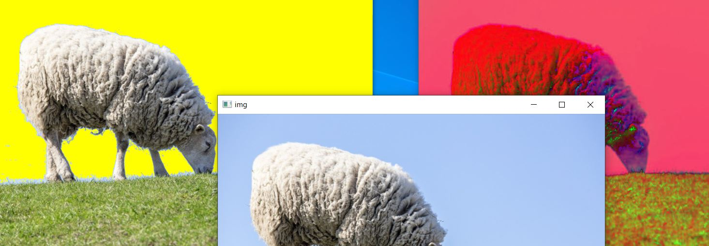

# Color range selector (for cv2.imRange)

Color range selector is for ```cv2.inRange```.  
```inRange``` requires lower range ange upper range.  
You can check color range easily using this tool.  



## How to boot ...

Windows  
```python -m cvplus.gui.color_range_selector --input-images c:\image-folder```  
Mac / Linux  
```python3 -m cvplus.gui.color_range_selector --input-images ~/image-folder```  

## Key assignment  

```esc``` : close application  
```q / a``` : switch image  
Manually adjust range  
|     | Lower:0 | Lower:1 | Lower:2 | Upper:0 | Upper:1 | Upper:2 | 
| --- | ------- | ------- | ------- | ------- | ------- | ------- | 
| +5  | ```2```       | ```3```       | ```4```       | ```5```       | ```6```       | ```7```       | 
| +1  | ```w```       | ```e```       | ```r```       | ```t```       | ```y```       | ```u```       | 
| -1  | ```s```       | ```d```       | ```f```       | ```g```       | ```h```       |  ```j```       |
| -5  | ```x```       | ```c```       | ```v```       | ```b```       | ```n```       | ```m```       | 


## Recommended option  
```--scale``` : display scale  
```--scale 0.5```  

```--color-code``` : color code  
```--color-code hls_full```

```--start-range``` : indicate initial range.   
  ```--start-range 0 10 40 30 200 49```  
