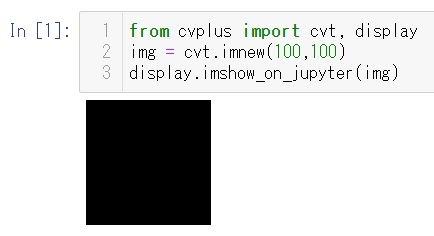

# DISPLAY module  

## imshow_on_jupyter  
Display Open CV image on the Jupyter Notebook  
```Python
from cvplus import cvt, display
img = cvt.imnew(100,100)
display.imshow_on_jupyter(img)
```  
  
