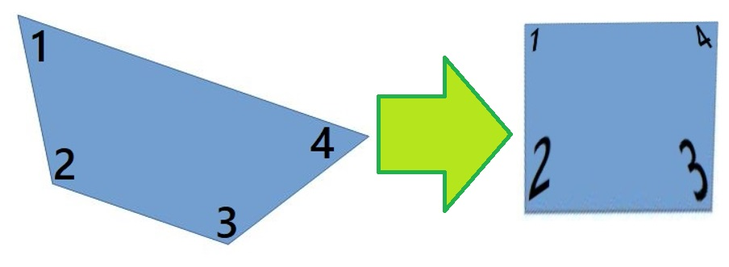

# Shape

## crop_simple_affin  
Cropping rect by 4 points using affine transformation.  

Defaulf point mode is counter clock wise.  
But you can choose point mode.  

- ccw_from_left_top (default)  
Counter clock wise from left top  
- cw_from_left_top  
Clock wise from left top
- left_top_down_right_top_down  
left top, left down, right top, right down  
- top_left_right_down_left_right  
top left, top right, down left, down right  

```python
from cvplus import cvt, shape

img = cvt.imread("test1.jpg")
pts = [[9, 9], [52, 194], [235, 252], [375, 139]]
img2 = shape.crop_simple_affin(img, pts, [200, 200])
cvt.imwrite("test2.jpg", img2)
```  
  
